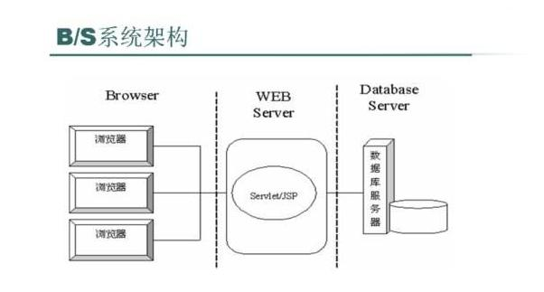
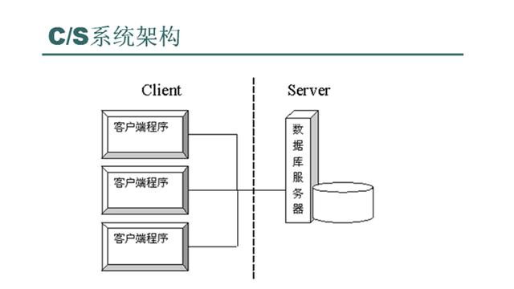

### 基础概念补充
#### 1.BS模式(Browser/Server)，CS模式(Client/Server)；
   
    BS：Web浏览器向Web服务器提出请求，由Web服务器对数据库进行操作，并将结果传回客户端;

    CS：客户应用程序+ 服务器管理程序 + 中间件;

    参考：https://www.cnblogs.com/jingmin/p/6493216.html；
    
    
#### 2.客户端（Client端），服务端（Serve端）；
   
    客户端、前端、服务端、后端区别：
      
    供用户使用的终端，叫做客户端；客户端的是一个比较广泛的概念，比如手机上的微信，钉钉这些应用程序就是客户端程序（而一般不会叫做前端程序），前端和客户端在概念上有耦合，客户端不等于前端；服务端、后端亦如此；
   
    参考链接，需辩证看待

    https://www.zhihu.com/question/35109166；
    https://zhidao.baidu.com/question/2207945957533216628.html；
    https://blog.51cto.com/u_11541173/5763222；
    https://blog.csdn.net/weixin_42995083/article/details/104251125；

#### 3.移动端，PC端
   
    移动端：APP，小程序，H5;

    APP：Android和IOS手机操作系统；
    小程序：微信APP内；
    H5：浏览器、APP和小程序的web-view组件内。

    PC端
   
    参考链接：https://www.woshipm.com/evaluating/2999903.html；

