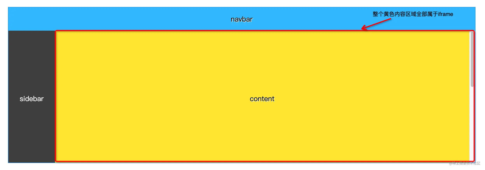
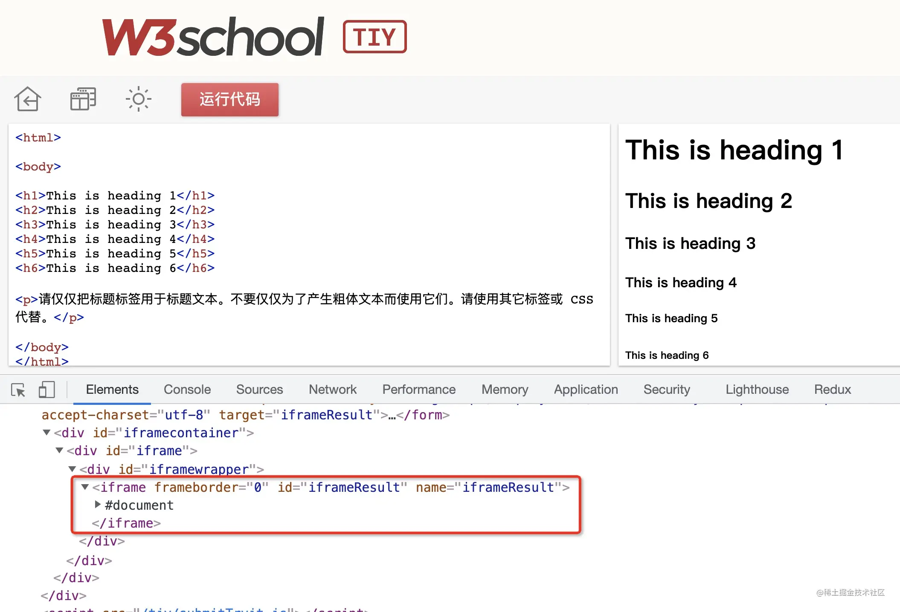
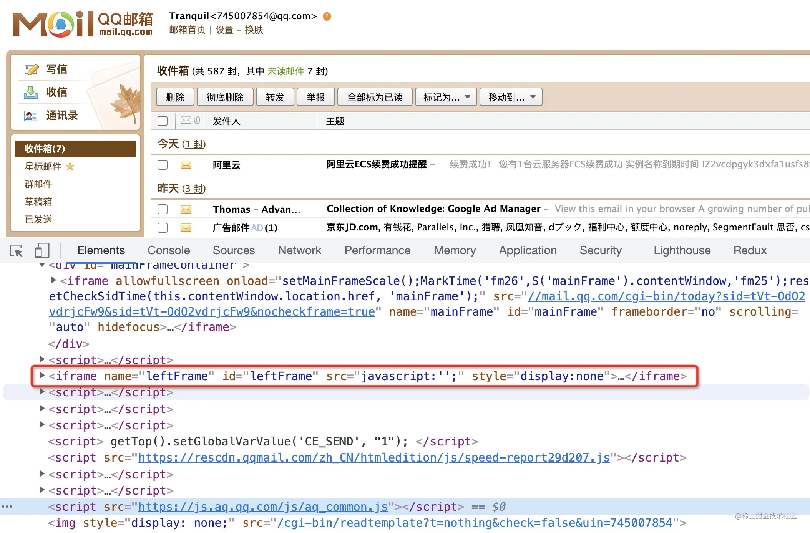

## 微前端与iframe 对比

参考资料：https://juejin.cn/post/7185070739064619068

qiankun的作者有一篇《Why Not Iframe》https://link.juejin.cn/?target=https%3A%2F%2Fwww.yuque.com%2Fkuitos%2Fgky7yw%2Fgesexv%3Fspm%3Data.21736010.0.0.25c06df01VID5V

介绍了iframe的优缺点（不过作者还有一篇《你可能并不需要微前端》给微前端降降火）https://link.juejin.cn/?target=https%3A%2F%2Fzhuanlan.zhihu.com%2Fp%2F391248835

 

 ### iframe适合的场景
如果页面本身比较简单，是一个没有弹窗、浮层、高度也是固定的纯信息展示页的话，用iframe一般没什么问题；

如果页面是包含弹窗、信息提示、或者高度不是固定的话，需要看iframe是否占据了全部的内容区域，如果是像下图这种经典的导航+菜单+内容结构、并且整个内容区域都是iframe，那么可以放心大胆地尝试iframe，否则，需要慎重考虑方案选型。

现在仍然能够找到使用 iframe 的网站（大多是旧的项目）
 W3C school：
 

 
 再比如邮箱：

使用iframe的弹窗居中问题
覆盖一下原来页面弹窗的样式，当包含hideLayout参数时，让弹窗的位置分别向左移动menuWidth/2、向上移动navbarHeight/2即可（遮罩位置不能动、也动不了）。